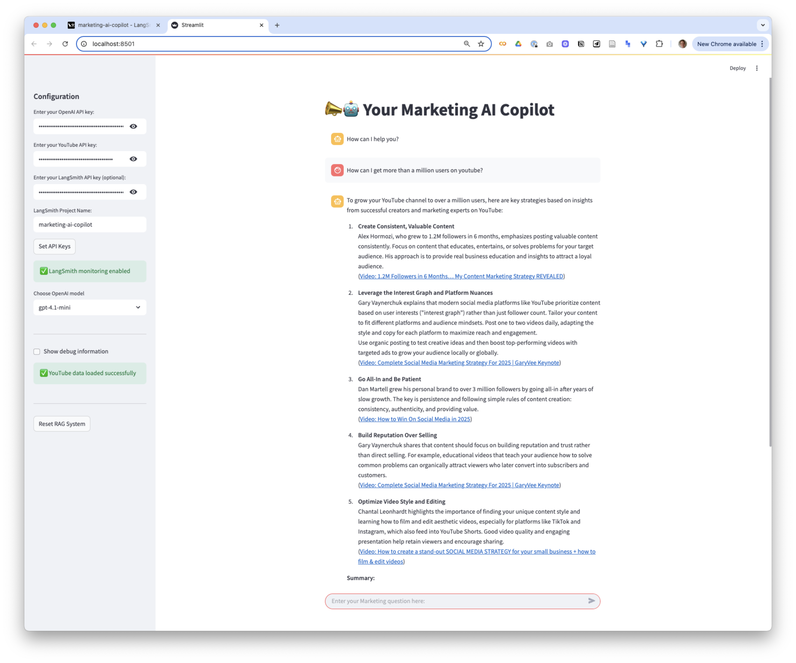
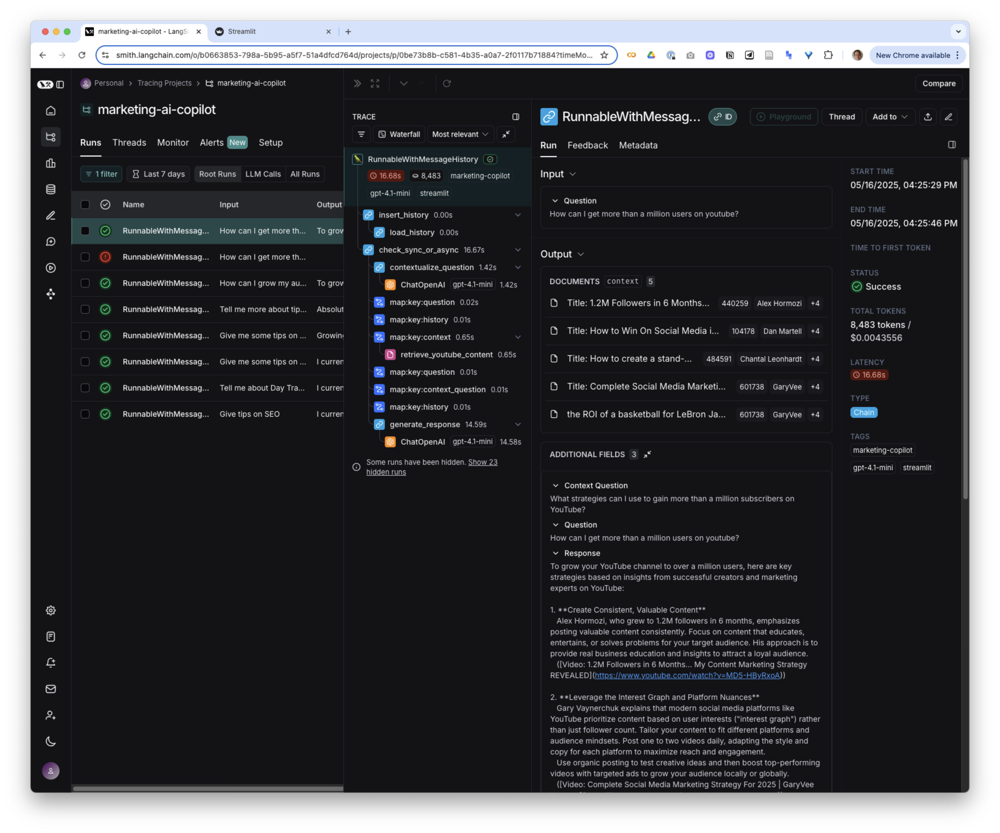

# 🚀 Marketing AI Copilot

Your awesome AI sidekick that scans YouTube videos and delivers marketing insights! Ask it anything about marketing and watch it work its magic.

🔗 **Try it live:** [marketing-ai-copilot.streamlit.app](https://marketing-ai-copilot.streamlit.app/)



## ✨ What This Tool Can Do

- 🔍 Find the best marketing content on YouTube
- 🧠 Process video transcripts efficiently
- 💾 Store knowledge in a vector database for quick retrieval
- 💬 Answer your marketing questions with relevant information
- 🧵 Remember your conversation for contextual responses

## 🛠️ Getting Started

1. Clone this repo
2. Install the dependencies:
```bash
uv sync
```

## 🔑 API Keys You'll Need

This app requires three API keys - two essential, one optional:

1. **OpenAI API Key** - Powers the brains of the operation
2. **YouTube API Key** - Finds those juicy marketing videos
3. **LangSmith API Key** (optional) - For the data nerds who want to monitor everything

All keys are entered directly in the app's sidebar - no `.env` file needed!

## 🎬 Getting a YouTube API Key

1. Visit the [Google Cloud Console](https://console.cloud.google.com/)
2. Create a new project (or select an existing one)
3. Navigate to "APIs & Services" > "Library"
4. Search for "YouTube Data API v3" and enable it
5. Go to "APIs & Services" > "Credentials"
6. Click "Create Credentials" > "API Key"
7. Copy your shiny new API key
8. Paste it into the app when prompted

## 🏃‍♀️ Fire It Up!

1. Launch the app:
```bash
streamlit run app.py
```
2. Enter your API keys in the sidebar
3. Start asking marketing questions!

## 🔬 LangSmith Integration

This app comes with LangSmith integration for advanced monitoring and debugging:



### 🎁 Cool Features
- 📊 Visualize the RAG pipeline in real-time
- 💰 Monitor token usage and costs
- 🔢 Track conversations with unique IDs
- 🐞 Debug retrieval quality
- 📈 Analyze system performance

### 🔧 Setting Up LangSmith

1. Create a LangSmith account at [smith.langchain.com](https://smith.langchain.com/)
2. Generate an API key in your settings
3. Add the key to the app sidebar
4. Customize your project name if desired (default: marketing-ai-copilot)

### 🧪 Using LangSmith Effectively

With LangSmith configured, each interaction is traced, allowing you to:

1. View detailed execution logs in the LangSmith UI
2. See the context being used for responses
3. Evaluate the quality of generated content
4. Track token usage across different models

Enable debug mode to get a direct link to the current trace in the LangSmith dashboard.

## 🛠️ Customization Options

Make it your own:

- Modify the default topic in `app.py` (TOPIC variable)
- Adjust retrieval parameters in `youtube_rag.py`
- Customize the RAG prompts in `youtube_rag.py`
